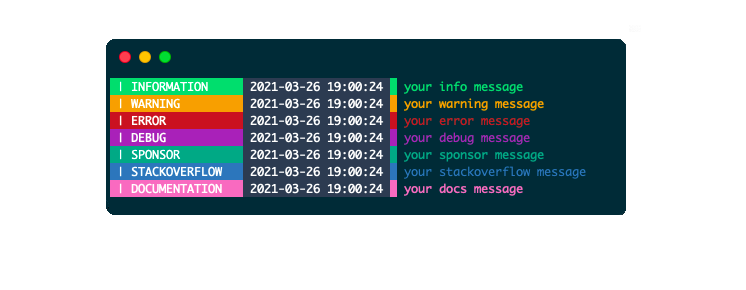

# 🦒 Chroma Logger for Python (faiton)

> The best alternative to the print statement


Inspired from [@ptkdev](https://github.com/ptkdev)

`hippity hoppity your code is now my property lmao` [Source](https://www.youtube.com/watch?v=tdhGiWqS-y4)

Before proceeding on the library explanation I'd want to thank a friend of mine who doesn't know how to code. PIE MANCO LU PRINT <3

Jokes aside, I'm slowly approaching to coding, despite I """know""" Python (faiton pæ), and using git at the same time. I know that this may sound weird like "dude, you don't even know how to code lmao" remember one thing: NO U!


## 📎 Menu
- 💡 [Features](#-features)
- 👔 [Screenshot](#-screenshot)
- 🚀 [How to use](#-installation)
- 📚 [Documentation](#-documentation)
- - 🔌 [Methods](#-methods)
- 👨‍💻 [Contributing](#-contributing)
- 🐛 [Known Bugs](https://github.com/dreamwhite/chroma-logger/issues?q=is%3Aopen+is%3Aissue+label%3Abug)

## 💡 Features
* [✔️] Easy to use
* [✔️] Linux / Mac OSX / Windows 10 (Powershell)
* [✔️] The best alternative to the raw print statement

## 👔 Screenshot
[](.github/assets/screenshots/chroma-logger-screen1.png)

## 🚀 Installation
1. Usage:
```python
from Chroma import Color
logger = Color();
logger.info("message");
```

See folder `examples`, run with `python3 example.py`.

## 🔌 Methods

| Method | Description | Parameters |
| --- | --- | --- |
| **debug**(`message`) | `message`: Display debug log message | `message`: string (mandatory)|
| **info**(`message`) | `message`: Display info log message| `message`: string (mandatory)|
| **warning**(`message`) | `message`: Display warning log message| `message`: string (mandatory)|
| **error**(`message`) | `message`: Display errors log message| `message`: string (mandatory)|
| **sponsor**(`message`) | `message`: Display sponsor log message| `message`: string (mandatory)|
| **stackoverflow**(`message`) | `message`: Display stackoverflow log message| `message`: string (mandatory) |
| **docs**(`message`) | `message`: Display docs log message| `message`: string (mandatory)|


## 📚 Documentation

I AM THE DOCUMENTATION

## ⚠️ Issues

If you encounter any issue, please file a bugreport [here](https://github.com/dreamwhite/bugtracker/issues/new?assignees=dreamwhite&labels=bug&template=generic.md&title=)

## 👨‍💻 Contributing

I'd really like if you submit a pull request!
What made me write this $hitty code (yeah i'm not a dev tho), is learning new stuff. Feel free to destroy my code haha

## 💫 License
Still need to decided which license I wanna apply there. Probably MIT tho
